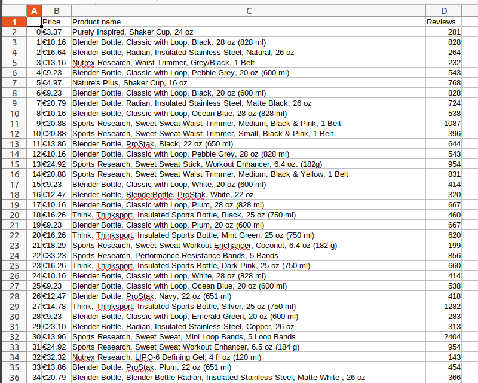

# web-scraping-2

## Web application that I used
```
Jupyter Notebook
```

## Used Python packages
```
BeautifulSoup
```

## Used Python library
```
1. requests
2. pandas
```

## Data scraped from:
```
[iherb](https://sk.iherb.com/c/sports-accessories)
```

## Images

